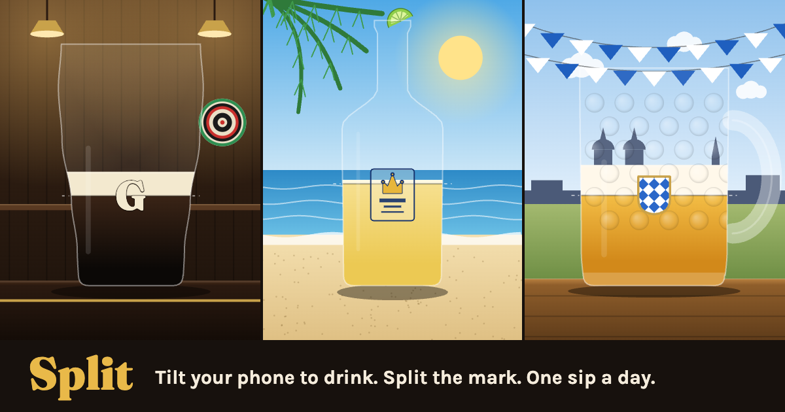

# Split

Hold to lift the glass, tip it, and take a sip. Release to bring it upright, then read the settled beer line through the middle of the mark. One scored sip a day, the same pour for everyone, and a postcard for the group chat: a beer, a place, and the memory of being there with friends.

**Play:** https://fischbeck3.github.io/split/



## How it plays

- **Hold.** Tap “Take today's sip”, then press and hold the glass or the “Hold to drink” button. The whole vessel lifts and tips while you drink; release to bring it upright and let the line settle. The space bar works on a keyboard; a focused hold button also supports Enter.
- **Phone tilt.** “Use phone tilt” is an optional secondary action. Start with the phone upright, then tip it either way to drink; tip farther to drink faster. Come back within 15 degrees of upright to stop. iPhones request motion access. If no sensor is available, the game uses hold mode.
- **The line.** What counts is the bottom of the head, where the foam meets the drink. Within 6% of the mark's height is a perfect split and within 16% is a split. The score is 100 at dead center and falls off quickly from there.
- **One a day.** The first completed sip each day is saved locally. Later sips are practice and cannot replace it. You can return to the saved score. A new glass arrives at local midnight.

## The first three days

| Day | Drink and place | Vessel and mark | Feel |
|---|---|---|---|
| 1 · Old Irish pub | Guinness in an old Irish pub | Tulip pint · the G | Smooth lift and tip; drinking stops immediately, then the vessel returns upright |
| 2 · Cabo beach | Corona at a beach palapa in Cabo, Mexico | Clear bottle with lime · the crown | Fast through the neck, slower deterministic glugs through the body |
| 3 · Oktoberfest | Festbier in a Munich beer tent | Liter stein · Bavarian crest | Slower, heavy pour with a short 0.24-second follow-through after release |

The vessel changes both the flow and movement. The pint tips toward 20 degrees, the bottle toward 24 degrees with a kick synchronized to each glug, and the stein toward 18 degrees with a slower lift and return. The liquid responds to gravity and damped slosh while preserving the amount in the glass. Your score waits for both the drink and the vessel movement to settle.

The pub pint has a dense cream head and foam lacing; the clear bottle has a long neck, shoulder, lip, condensation, fine fizz, and a rising air pocket with each glug; the stein has thick dimpled glass and a generous head. These details carry into the share card. Reduced motion keeps the vessel upright, shows liquid progress, and retains static material detail. After day 3, the game picks from eleven glasses by date and never pours the same glass two days running.

The opening places use painted travel illustrations: aged oak, amber lamps, and a fireplace in the pub; a shaded palapa, turquoise water, and the Cabo headland at the beach; timber roof ribs, Bavarian bunting, and communal tables in Munich. Small distant figures suggest friends without competing with the glass or the scoring mark. The table stays anchored beneath the vessel in the game, movement preview, and exported postcard.

These are illustrative scenes, not photographs of a specific venue. The three compressed WebP assets are self-hosted in `site/assets/scenes/`; their generation prompts and framing metadata are recorded in `generation.json`. The game loads and decodes only the selected place once, then caches its painted backdrop. The review routes load all three. A missing scene image falls back to the existing canvas illustration. There is no runtime image generation or external image service.

## Share your sip

“Share your sip” uses the native share sheet when it supports image files, or downloads a PNG. “Copy text” provides a compact group-chat result. If automatic copying fails, the text disclosure opens, focuses and selects the result, and scrolls it into view for manual copying; the next result closes that disclosure again.

The 1080 × 1350 image frames the same place and vessel as a paper postcard, with a destination title and drink above the scene. It shows your actual settled beer line, MARK and STOP guides, score out of 100, verdict, and a five-cell position strip. The strip is one stopping position from high to low, with a green center; an arrow shows a stop beyond its range. It is not a history of attempts. “One sip. Your turn.” invites a friend to play. Text shares use the same one-row strip, the daily drink and destination, and the game link. Both formats label practice and preview sips.

The place gently brightens when it is ready. Holding visibly depresses the drink control. After release, the game paints the real upright stopping line before revealing the result and postcard. Sharing shows a busy state, followed by a short shared, saved, or copied confirmation. Reduced motion removes spatial and reveal animation while preserving the sip, score, and feedback.

## Preview and add a day

Open `/design.html` to try the first three days together and see their sample image and text shares. The sample cards are illustrative preview results; no daily scores are saved there. Open `/#day1`, `/#day2`, or `/#day3` for an individual preview. The same `#dayN` format works for other day numbers. Preview scores never save to the daily record.

Open `/motion.html` to play an illustrative sip across all three vessels, or freeze Ready, Drinking, Just released, and Settled. This route uses the game's movement and liquid geometry and never saves a score. The three-day review links to it.

Every glass lives in `site/js/themes.js`, and the fields are described at the top of that file. Add an entry to `THEMES`, and put its `id` in `SCHEDULE` to pin it to a day. Run `npm test` to check that its mark can be reached, then preview that day. `LAUNCH` is the local date for day No. 1; move it to restart the planned run on a new date.

The extracted visual system is in [DESIGN.md](DESIGN.md), with component previews and extensions in `.impeccable/design.json`.

## Run it locally

```
npm start
```

This serves the game on http://localhost:8000, the three-day review on http://localhost:8000/design.html, and the movement preview on http://localhost:8000/motion.html. Hold mode works there. Phones require HTTPS for tilt, so try tilt on the live site.

```
npm test
```

The tests cover the schedule, score boundaries, reachable marks, vessel flow and movement settling across frame rates, preserved liquid geometry in tilted vessels, reduced motion, and text-share semantics. There is nothing to install: the project has no dependencies. Fraunces and Karla are self-hosted in `site/fonts/`, with their OFL licenses alongside the font files.

## Deploy

Every push to `main` runs the tests on GitHub Actions. When they pass, `site/` is published to GitHub Pages.

## Layout

- `site/index.html` and `site/css/style.css`: the game page and shared styles
- `site/design.html`: the first-three-day review and sample shares
- `site/motion.html`: sip playback and frozen movement stages, without saved scores
- `site/js/themes.js`: the glasses, palettes, and calendar
- `site/js/core.js`: the daily seed, vessel shapes, drink physics, and scoring, with no page code so tests run in Node
- `site/js/motion.js`: deterministic vessel lift, tipping, glug movement, slosh, and return to rest
- `site/js/liquid.js`: the liquid surface that preserves the filled area while a vessel tilts
- `site/js/draw.js`: shared place assets and canvas fallback, glass material, beer, foam, printed names, and marks
- `site/js/share.js`: the destination postcard and plain-text result
- `site/js/main.js`: input, the tilt sensor, results, local daily records, and sharing
- `site/assets/scenes/`: compressed place illustrations and their generation/framing metadata
- `site/fonts/`: local fonts and license files
- `test/`: the tests
- `scripts/serve.js`: the local server

Split is not affiliated with any brewer or brand. The vessels use simplified shapes, brand names, and marks drawn on canvas, layered over illustrative travel scenes.
