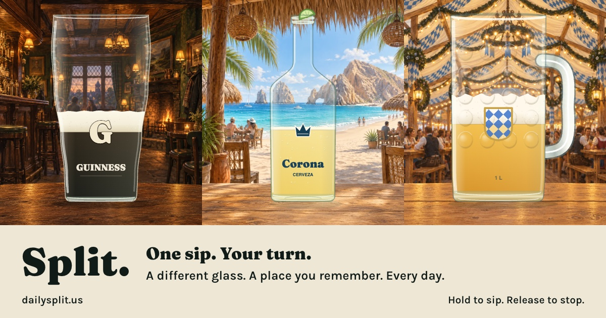

# Split

Hold to lift the glass, tip it, and take a sip. Release to bring it upright, then read the settled beer line through the middle of the mark. One scored sip a day, the same pour for everyone, and a postcard for the group chat: a beer, a place, and the memory of being there with friends.

**GitHub Pages address:** https://fischbeck3.github.io/split/ · **Configured public address:** https://dailysplit.us/

The domain is registered at Network Solutions. GitHub ownership is verified, the repository's Pages custom domain is assigned, and the registrar has the GitHub DNS records saved. The updated preview is published and verified in a returning browser; the versioned module graph prevents new HTML from loading older game code. GitHub is still provisioning the HTTPS certificate. The release configuration keeps the official calendar closed: the root and date links show an unsaved opening pub preview, and `#dayN` links preserve individual design previews. The opening daily run should start as soon as the domain is serving the game over HTTPS and the release date is fixed; day No. 1 has not been released.



## How it plays

- **Hold.** Tap “Take a preview sip” (or “Take today's sip” after launch), then press and hold the glass or the “Hold to drink” button. The whole vessel lifts and tips while you drink; release to bring it upright and let the line settle. The space bar works on a keyboard; a focused hold button also supports Enter.
- **Phone tilt.** “Use phone tilt” is an optional secondary action. Start with the phone upright, then tip it either way to drink; tip farther to drink faster. Come back within 15 degrees of upright to stop. iPhones request motion access. If no sensor is available, the game uses hold mode.
- **The line.** What counts is the bottom of the head, where the foam meets the drink. Within 6% of the mark's height is a perfect split and within 16% is a split. The score is 100 at dead center and falls off quickly from there.
- **One a day, after launch.** The first completed sip for today's local date is saved in this browser. Later sips are practice and cannot replace it. You can return to the saved score. A new glass arrives at local midnight. Pending-launch previews never write official records.
- **Same glass for a friend, after launch.** Public shares carry `?day=YYYY-MM-DD`, so a friend opens the same seeded pour. Today's challenge can count once; earlier dates open as Archive and new archive sips never write a daily record. A friend one calendar day ahead shares an unsaved preview of that exact pour. Later future dates, malformed dates, and dates before the first sip return to today's glass with an explanation.

If midnight passes during a sip, that glass becomes an archive and the finished sip is not saved. A result saved before midnight remains labeled “Archive · saved sip.” “Take today's sip” opens the current glass and clears the old date link. Browser records do not sync across devices or domains; clearing storage removes them. Records belong to the fixed launch calendar, so older prototype scores do not carry into the public run.

## The first three days

| Day | Drink and place | Vessel and mark | Feel |
|---|---|---|---|
| 1 · Old Irish pub | Guinness in an old Irish pub | Tulip pint · the G | Smooth lift and tip; drinking stops immediately, then the vessel returns upright |
| 2 · Cabo beach | Corona at a beach palapa in Cabo, Mexico | Clear bottle with lime · the crown | Fast through the neck, slower deterministic glugs through the body |
| 3 · Oktoberfest | Festbier in a Munich beer tent | Liter stein · Bavarian crest | Slower, heavy pour with a short 0.24-second follow-through after release |

The vessel changes both the flow and movement. The pint tips toward 20 degrees, the bottle toward 24 degrees with a kick synchronized to each glug, and the stein toward 18 degrees with a slower lift and return. The liquid responds to gravity and damped slosh while preserving the amount in the glass. Your score waits for both the drink and the vessel movement to settle.

The pub pint has a dense cream head and foam lacing; the clear bottle has a long neck, shoulder, lip, condensation, fine fizz, and a rising air pocket with each glug; the stein has thick dimpled glass and a generous head. These details carry into the share card. Reduced motion keeps the vessel upright, shows liquid progress, and retains static material detail. After day 3, the game picks from eleven glasses by date and never pours the same glass two days running.

The opening places use painted travel illustrations: aged oak, amber lamps, and a fireplace in the pub; a shaded palapa, turquoise water, and the Cabo headland at the beach; timber roof ribs, Bavarian bunting, and communal tables in Munich. Small distant figures suggest friends without competing with the glass or the scoring mark. The table stays anchored beneath the vessel in the game, movement preview, and exported postcard.

These are illustrative scenes, not photographs of a specific venue. The three compressed WebP assets are self-hosted in `site/assets/scenes/`; their generation prompts and framing metadata are recorded in `generation.json`. The game loads and decodes only the selected place once, then caches its painted backdrop. The review routes load all three. A missing scene image falls back to the existing canvas illustration. There is no runtime image generation or external image service.

## Share your sip

“Share your sip” immediately opens the native share sheet with the text result: the score and Wordle-like position strip as text, plus the exact-day or preview link as a native URL item. It does not wait for a postcard image. If native text sharing is unavailable or fails, it copies the result; if copying is denied, “See text card” opens with the text focused and selected for manual copying. “Copy text” is inside that disclosure, and the next result closes it again. “Save postcard” is the explicit PNG download action; sharing never silently downloads an image.

Messages can build a website link preview from the static Open Graph metadata. Its 1200 × 630 image uses the current Irish pub, Cabo beach, and Munich scenes with the hold-to-sip instruction. The versioned image address avoids reusing the old vector-art preview and is preserved by launch preparation. This is a shared website card; each player’s result remains in the message text. Both the page and preview image must be publicly reachable over HTTPS. Actual iPhone Messages rendering still needs a device check after the certificate is ready.

The 1080 × 1350 image frames the same place and vessel as a paper postcard, with a destination title and drink above the scene. It shows your actual settled beer line, MARK and STOP guides, score out of 100, verdict, and a five-cell position strip. The strip is one stopping position from high to low, with a green center; an arrow shows a stop beyond its range. It is not a history of attempts. “One sip. Your turn.” invites a friend to play. Text shares use the same one-row strip, the daily drink and destination, and a date-specific game link. The postcard prints that same address. Both formats label practice, archive, and preview sips; preview links retain `#dayN` and never become scored challenges.

The place gently brightens when it is ready. Holding visibly depresses the drink control. After release, the game paints the real upright stopping line before revealing the result and postcard. Sharing shows a busy state, followed by a short shared or copied confirmation; saving the postcard confirms the download separately. Reduced motion removes spatial and reveal animation while preserving the sip, score, and feedback.

## Preview and add a day

Open `/design.html` to try the first three days together and see their sample image and text shares. The sample cards are illustrative preview results; no daily scores are saved there. Open `/#day1`, `/#day2`, or `/#day3` for an individual preview. The same `#dayN` format works for other day numbers. Preview scores never save to the daily record.

Open `/motion.html` to play an illustrative sip across all three vessels, or freeze Ready, Drinking, Just released, and Settled. This route uses the game's movement and liquid geometry and never saves a score. The three-day review links to it.

Every glass lives in `site/js/themes.js`, and the fields are described at the top of that file. Add an entry to `THEMES`, and put its `id` in `SCHEDULE` to pin it to a day. Run `npm test` to check that its mark can be reached, then preview that day. The launch date is fixed after release: changing it would renumber shared challenges. While the launch gate is closed, or before the configured launch date, the root route shows a preview sip.

The extracted visual system is in [DESIGN.md](DESIGN.md), with component previews and extensions in `.impeccable/design.json`.

## Run it locally

```
npm start
```

This serves the game on http://localhost:8000, the three-day review on http://localhost:8000/design.html, and the movement preview on http://localhost:8000/motion.html. Hold mode works there. Phones require HTTPS for tilt, so try tilt on the live site.

```
npm test
```

The tests cover the schedule, date links and recording eligibility, score boundaries, reachable marks, vessel flow and movement settling across frame rates, preserved liquid geometry in tilted vessels, reduced motion, share semantics, and launch preparation. There is nothing to install: the project has no dependencies. Fraunces and Karla are self-hosted in `site/fonts/`, with their OFL licenses alongside the font files.

## Deploy

Every push to `main` runs the tests on GitHub Actions. When they pass, `npm run build` copies `site/` into the ignored `.pages/` directory. The build applies the same Git commit SHA as a query version to local JavaScript imports and HTML script/CSS references, keeping each deployment's module graph together when browsers cache assets. The workflow uploads `.pages/` to GitHub Pages; source files remain in `site/`.

### Connect dailysplit.us

The domain is registered at Network Solutions. In its Account Manager, open Domains → dailysplit.us → Advanced Tools → Advanced DNS Records → Manage. [Network Solutions DNS instructions](https://www.networksolutions.com/help/article/manage-dns-adns-records).

1. **Complete:** `dailysplit.us` ownership is verified in the GitHub account's Pages settings using the registrar TXT record. Keep that TXT record. [GitHub domain verification](https://docs.github.com/en/pages/configuring-a-custom-domain-for-your-github-pages-site/verifying-your-custom-domain-for-github-pages).
2. **Complete:** `Fischbeck3/split` → Settings → Pages has `dailysplit.us` assigned as its custom domain.
3. **Saved at Network Solutions:** all four root A records and the `www` CNAME below. Confirm authoritative DNS resolves to these values:

| Type | Name | Value |
|---|---|---|
| A | `@` | `185.199.108.153` |
| A | `@` | `185.199.109.153` |
| A | `@` | `185.199.110.153` |
| A | `@` | `185.199.111.153` |
| CNAME | `www` | `fischbeck3.github.io` |

4. **Pending:** confirm propagated DNS, wait for the HTTPS certificate, enable Enforce HTTPS, and check that `https://www.dailysplit.us/` redirects to `https://dailysplit.us/`. DNS and certificate readiness may take up to 24 hours. The CNAME target has no `/split` path. This custom Actions workflow does not require a repository `CNAME` file. [GitHub custom-domain setup](https://docs.github.com/en/pages/configuring-a-custom-domain-for-your-github-pages-site/managing-a-custom-domain-for-your-github-pages-site).

### Set the opening date and release

`site/js/config.js` centralizes `SITE_URL`, `LAUNCH`, and `LAUNCH_READY`. It currently contains the configured domain, the development date `2026-10-08`, and `LAUNCH_READY = false`. That runtime gate keeps root and date links on the opening pub preview and blocks all official recording. Hash-based `#dayN` previews still work. Deploying this preview does not start the daily calendar.

When DNS and HTTPS are ready for release, use that day's local date in place of `YYYY-MM-DD`:

```
npm run prepare-launch -- YYYY-MM-DD --check
npm run prepare-launch -- YYYY-MM-DD
npm test
```

`--check` prints the plan without editing files. Preparation sets day No. 1, sets `LAUNCH_READY = true`, freezes the date, and synchronizes the canonical URL and social metadata. It refuses a different launch date once frozen. Review and commit the resulting diff, then release to `main`; the script itself does not deploy or change DNS. After release, preserve existing dates, seeds, and scheduled themes so shared links continue to identify the same glass.

Follow-up playtest checks are still open: iPhone and Android hold/release, optional sensor permission, native text sharing, postcard download, copied links, and midnight rollover on the HTTPS domain. Physical-phone tilt and native text sharing have not been tested. Choose an analytics project and add starts, finishes, share actions, friend-link arrivals, and next-day returns; analytics is not integrated in this branch. No backend, daily job, or runtime image service is required for the game itself.

## Layout

- `site/index.html` and `site/css/style.css`: the game page and shared styles
- `site/design.html`: the first-three-day review and sample shares
- `site/motion.html`: sip playback and frozen movement stages, without saved scores
- `site/js/themes.js`: the glasses, palettes, and calendar
- `site/js/config.js`: planned public address and fixed release date
- `site/js/challenge.js`: local-day links, preview/archive states, and recording eligibility
- `site/js/core.js`: the daily seed, vessel shapes, drink physics, and scoring, with no page code so tests run in Node
- `site/js/motion.js`: deterministic vessel lift, tipping, glug movement, slosh, and return to rest
- `site/js/liquid.js`: the liquid surface that preserves the filled area while a vessel tilts
- `site/js/draw.js`: shared place assets and canvas fallback, glass material, beer, foam, printed names, and marks
- `site/js/share.js`: the destination postcard and plain-text result
- `site/js/main.js`: input, the tilt sensor, results, local daily records, and sharing
- `site/assets/scenes/`: compressed place illustrations and their generation/framing metadata
- `site/fonts/`: local fonts and license files
- `test/`: the tests
- `scripts/serve.js`: the local server
- `scripts/build-pages.js`: versioned Pages output in `.pages/`, using the deployment's Git commit SHA
- `scripts/prepare-launch.js`: reviewed launch-date and metadata preparation, without deployment or DNS changes

Split is not affiliated with any brewer or brand. The vessels use simplified shapes, brand names, and marks drawn on canvas, layered over illustrative travel scenes.
