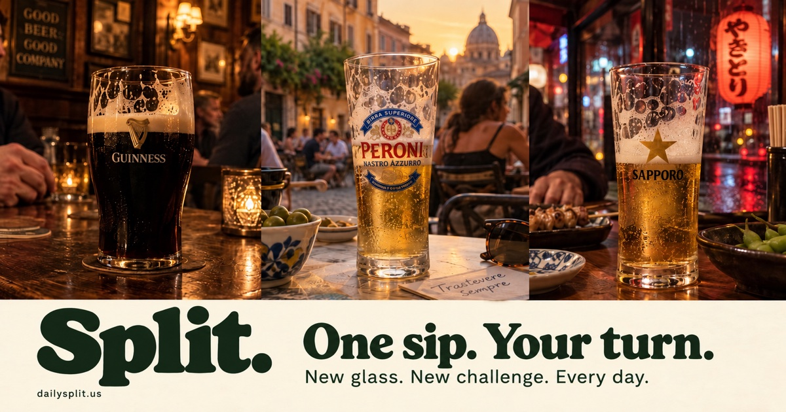

# Split

Hold to lift the glass, tip it, and take a sip. Release a little early to bring it upright, then read the settled beer line through the middle of the mark. One scored sip a day, the same pour for everyone, and a postcard for the group chat: a beer, a place, and the memory of being there with friends.

**GitHub Pages address:** https://fischbeck3.github.io/split/ · **Configured public address:** https://dailysplit.us/

The domain is registered at Network Solutions. GitHub ownership is verified, the repository's Pages custom domain is assigned, and HTTPS is valid and enforced. The root returns the game and `www` redirects to the HTTPS root. The launch date remains October 9, 2026: day No. 1 in the old Irish pub, followed by Trastevere sunset on October 10 and Tokyo izakaya on October 11. Oktoberfest follows on October 12, snowy Hogsmeade on October 13, and Cabo on October 14. The release configuration opens official daily recording for root and date links; `#dayN` previews remain unsaved. The versioned module graph keeps each deployment's HTML and game code together.



## How it plays

- **Hold.** Tap “Take today's sip” (or “Take a preview sip” on a preview), then press and hold the glass or the “Hold to drink” button. The whole vessel lifts and tips farther as it empties; release a little early to bring it upright and let the moving sip settle. The space bar works on a keyboard; a focused hold button also supports Enter.
- **Glass motion.** The glass button beside the day number switches tipping on or off and remembers your choice in this browser. Until you choose, it follows your device’s reduced-motion setting; a short note explains a still glass. Switching motion changes presentation only, with identical liquid dynamics and scoring. A shared challenge cannot change the recipient’s motion preference.
- **Phone tilt.** “Use phone tilt” is an optional secondary action. Start with the phone upright, then tip it either way to drink; tip farther to drink faster. Come back within 15 degrees of upright to stop. iPhones request motion access. If no sensor is available, the game uses hold mode.
- **The line.** What counts is the bottom of the head, where the foam meets the drink. Within 6% of the mark's height is a perfect split and within 16% is a split. The score is 100 at dead center and falls off quickly from there.
- **One a day.** The first completed sip for today's local date is saved in this browser. Later sips are practice and cannot replace it. You can return to the saved score. A new glass arrives at local midnight. Preview sips never write official records.
- **Same glass for a friend.** Public shares carry `?day=YYYY-MM-DD`, so a friend opens the same seeded pour. Today's challenge can count once; earlier dates open as Archive and new archive sips never write a daily record. A friend one calendar day ahead shares an unsaved preview of that exact pour. Later future dates, malformed dates, and dates before the first sip return to today's glass with an explanation.
- **Beat my sip.** Result links also carry the shared score and stopping offset. A friend sees the score to beat before playing, then their own score and both real stopping lines on the postcard. These are self-reported comparisons, without accounts or a leaderboard; daily, practice, archive, and preview labels stay explicit. Invalid benchmarks are ignored without changing the daily seed or recording rule.
- **Sip sounds.** The speaker button starts off. Enable it for bottle glugs, a soft pint landing, a heavier stein landing, and a quiet rim click for a perfect split. Unsupported or blocked audio leaves play available. Sound stops when the page is hidden.

If midnight passes during a sip, that glass becomes an archive and the finished sip is not saved. A result saved before midnight remains labeled “Archive · saved sip.” “Take today's sip” opens the current glass and clears the old date link. Browser records do not sync across devices or domains; clearing storage removes them. Records belong to the fixed launch calendar and the configured record run.

The friends soft launch starts on the existing Day 1, October 9. `RECORD_RUN` is fixed at `friends-2026-10-09`, giving returning test browsers a fresh first sip and empty stats after refreshing. Earlier attempts remain untouched under their old storage key; motion preferences and analytics history remain intact. The calendar, seeded pours, and existing challenge links keep their original meaning. Keep this run fixed when inviting a wider audience so friends retain their scores and streaks.

## The first six days

| Day | Drink and place | Vessel and mark | Feel |
|---|---|---|---|
| 1 · Oct 9, 2026 · Old Irish pub | Guinness in an old Irish pub | Tulip pint · the G | Smooth lift and progressively deeper tip; tapered cross-section accelerates the line and a brief release tail rewards anticipation |
| 2 · Oct 10, 2026 · Trastevere sunset | Peroni at a Roman café table | Tall glass · red-and-blue Peroni label | Light lager, accelerating sip, brief afterflow |
| 3 · Oct 11, 2026 · Tokyo izakaya | Sapporo at a rain-lit counter | Tall star glass · gold star | Crisp lager, accelerating sip, brief afterflow |
| 4 · Oct 12, 2026 · Oktoberfest | Festbier in a Munich beer tent | Liter stein · Bavarian crest | Slower, heavy pour with a short 0.24-second follow-through after release |
| 5 · Oct 13, 2026 · Snowy Hogsmeade | Butterbeer beneath snowy rooftops | Tulip glass · Hogwarts-style crest | Creamy head, slower sip, brief afterflow |
| 6 · Oct 14, 2026 · Cabo beach | Corona at a beach palapa in Cabo, Mexico | Clear bottle with lime · the crown | Fast through the neck, slower deterministic glugs through the body |

The vessel changes both the flow and movement. A round glass’s cross-sectional area is proportional to its radius squared: for the same volume removed per second, the line falls faster toward the narrow bottom of a pint and slower after a bottle’s shoulder. Momentum is integrated as volume flow, with smooth startup and short release tails: at most 0.42 seconds for the tulip pint, 0.21 seconds for the bottle, and 0.24 seconds for the stein. The line continues moving during that tail, so release before the target rather than at it. Bottle glugs remain deterministic.

The pint begins around 20 degrees, the bottle around 24 degrees with a kick synchronized to each glug, and the stein around 18 degrees with a slower lift and return. Each tips farther as it empties. The liquid stays near gravity-horizontal with damped slosh, preserving actual round-vessel volume through the tilt and bottle shoulder. Your score waits for both the drink and the vessel movement to settle. This is a bounded gameplay approximation of continuity and momentum, not a turbulence or spill simulation.

A thin dashed line briefly shows the exact target before each sip, then fades. Opening How to play shows it again. Reduced motion keeps the cue static until it clears; beginning the drink clears it immediately. Match the settled beer line beneath the foam to that height, or the top of Guinness's G crossbar. Compact brand artwork replaces the permanent aiming notches: Corona's crown, Sapporo's gold star, Peroni's red-and-blue label, and Butterbeer's quartered Hogwarts-style crest. Postcards retain their MARK/STOP guides and use the same logos. Artwork remains separate from the seeded score tolerance, so daily pours and saved scores stay intact.

The pub pint has a dense cream head and foam lacing; the clear bottle has a long neck, shoulder, lip, condensation, fine fizz, and a rising air pocket with each glug; the stein has thick dimpled glass and a generous head. These details carry into the share card. Reduced motion defaults to an upright vessel, shows liquid progress, and retains static material detail. An explicit glass-motion choice can enable tipping while decorative motion still respects the device preference. After day 6, unpinned dates use the frozen fourteen-glass rotation, which avoids consecutive repeats. Reviewed future date pins can choose a different lineup without rerolling old challenges.

The opening places use painted travel illustrations: aged oak, amber lamps, and a fireplace in the pub; warm Roman stone and a café table at sunset; rain-lit lanterns and a little counter in Tokyo. Small distant figures suggest friends without competing with the glass or the scoring mark. The table stays anchored beneath the vessel in the game, movement preview, and exported postcard.

Each scheduled place carries a short memory cue. The pub, Cabo, and Munich add subtle environmental motion around the vessel: painted pub flames curl above a fixed grate, Cabo surf moves, and Munich canopy cloth stirs without altering the glass or its physics. Reduced motion and exported postcards retain the static scene. A brief highlight follows the real stopping line as the result appears, with a stronger line flash for perfect splits; controls and the recorded score are available immediately.

Tokyo, snowy Hogsmeade, and Trastevere reuse the chosen panels from the concept illustrations: Tokyo option 1, snowy Hogsmeade option 3, and Trastevere option 1. The renderer crops each triptych with a two-pixel inset and preserves the same tabletop anchor in the game and postcard. Scene assets load only for the selected daily place. These scenes remain static around the moving vessel.

These are illustrative scenes, not photographs of a specific venue. The three compressed WebP assets are self-hosted in `site/assets/scenes/`; their generation prompts and framing metadata are recorded in `generation.json`. The game loads and decodes only the selected place once, then caches its painted backdrop. The review routes load all three. A missing scene image falls back to the existing canvas illustration. There is no runtime image generation or external image service.

## Share your sip

“Beat my sip” immediately opens the native share sheet with the text result: the score and Wordle-like position strip as text, plus the exact-day or preview link and shared benchmark as a native URL item. It does not wait for a postcard image. If native text sharing is unavailable or fails, it copies the result; if copying is denied, “See text card” opens with the text focused and selected for manual copying. “Copy text” is inside that disclosure, and the next result closes it again. “Save postcard” is the explicit PNG download action; sharing never silently downloads an image.

Messages can build a website link preview from the static Open Graph metadata. Its 1200 × 630 photo-style image shows Guinness in the Irish pub, Peroni in Trastevere, and Sapporo in Tokyo, with friends in the background. The cream band carries “One sip. Your turn.” and “New glass. New challenge. Every day.” The new image address avoids reusing an older preview and is preserved by launch preparation. This is a shared website card; each player’s result remains in the message text. Both the page and preview image must be publicly reachable over HTTPS. Actual iPhone Messages rendering still needs a physical-device check.

The 1080 × 1350 image frames the same place and vessel as a paper postcard, with a destination title and drink above the scene. It shows your actual settled beer line, MARK and STOP guides, score out of 100, verdict, and a five-cell position strip. The strip is one stopping position from high to low, with a green center; an arrow shows a stop beyond its range. It is not a history of attempts. “One sip. Your turn.” invites a friend to play. Text shares use the same one-row strip, the daily drink and destination, and a date-specific game link. The postcard prints that same address. Both formats label practice, archive, and preview sips; preview links retain `#dayN` and never become scored challenges.

The place gently brightens when it is ready. Holding visibly depresses the drink control. After release, the game paints the real upright stopping line before revealing the result and postcard. Sharing shows a busy state, followed by a short shared or copied confirmation; saving the postcard confirms the download separately. Reduced motion removes spatial and reveal animation while preserving the sip, score, and feedback.

## Preview and add a day

Open `/design.html` to try the first three days together and see their sample image and text shares. The sample cards are illustrative preview results; no daily scores are saved there. Open `/#day1`, `/#day2`, or `/#day3` for an individual preview. The same `#dayN` format works for other day numbers. Preview scores never save to the daily record.

Open `/next-days.html` for nine playable scene-and-glass concepts: Sapporo in Japan, Butterbeer in Hogsmeade, and Peroni in Rome. Each drink has three painted places, vessel-specific flow, a real stopping-line postcard, and an in-memory shortlist. Six later-place pitches broaden the options. The studio catalog lives separately in `site/js/concepts.js`; it does not set official dates, save results, or alter the daily seed. Trastevere is scheduled as day 2, Tokyo as day 3, and snowy Hogsmeade as day 5; studio seeds and shortlist stay separate from daily play. Open `/next-three.html` for days 4–6: Oktoberfest, snowy Hogsmeade, and Cabo, with playable hash previews and sample postcards.

Open `/motion.html` to play an illustrative sip across all three vessels, or freeze Ready, Drinking, Just released, and Settled. This route uses the game's movement and liquid geometry and never saves a score. The three-day review links to it.

Every glass lives in `site/js/themes.js`, and the fields are described at the top of that file. Add a new entry to `THEMES`, then propose its `id` for an explicit future date through the calendar plan below. Keep `LEGACY_OPENING_IDS`, `LEGACY_ROTATION_IDS`, released dates, and existing theme definitions fixed; appending a catalog entry must not reroll old automatic challenges. `SCHEDULE` remains the frozen opening list, not a place to schedule new days. Run `npm test` to check that the new glass's mark can be reached, then preview its reviewed date. The launch date is fixed after release: changing it would renumber shared challenges. While the launch gate is closed, or before the configured launch date, the root route shows a preview sip.

The extracted visual system is in [DESIGN.md](DESIGN.md), with component previews and extensions in `.impeccable/design.json`.

## Plan the daily calendar

Open `/calendar.html` for the month/week lineup and a day inspector with the current drink, place, vessel, published run, and unsaved `#dayN` preview. Released, scheduled, and automatic-rotation dates describe the game lineup. Draft badges describe proposals and never change that lineup. Halloween week, October 25–31, starts as an unapproved draft using existing glasses as placeholders; holiday artwork has not been approved.

Choose a future date to propose a catalog glass, run, and review note, or create a named run with inclusive start/end dates. A new run fills its dates with existing-glass placeholders for further editing. Browser edits are allowed only after the date already live in UTC+14, protecting a challenge that has opened anywhere in the world. Published days and published runs cannot be changed from this page. Source proposals remain visible when they become past dates, but their live portions are locked.

Drafts persist in this browser's local storage. They do not sync to another browser or update the game or subscription feeds. Invalid saved data falls back to the source plan and leaves the saved copy untouched; unavailable storage still allows editing in memory, with an export prompt. JSON import validates catalog IDs, real dates, run spans and overlaps, and rejects changes to the published baseline. Review a selected draft or all draft dates before choosing **Export plan for review**.

The export contains the full versioned plan: `days` are the published baseline, `drafts` hold proposed dates and notes, and `campaigns` hold named run spans with `draft` or `published` status. Review the JSON with Codex, including the artwork and playable glass. The CLI prints the exact proposed changes and never deploys the site:

```sh
# Review draft changes without writing anything.
node scripts/content-calendar.js --check /path/to/split-calendar-plan.json

# Save reviewed proposals into calendar-data.js; keep them as drafts.
node scripts/content-calendar.js --apply /path/to/split-calendar-plan.json

# Review promotion of every draft in this export, without writing.
node scripts/content-calendar.js --publish /path/to/split-calendar-plan.json --check

# Promote the reviewed future drafts locally.
node scripts/content-calendar.js --publish /path/to/split-calendar-plan.json

# Or review and promote one particular draft date.
node scripts/content-calendar.js --publish /path/to/split-calendar-plan.json --date YYYY-MM-DD --check
node scripts/content-calendar.js --publish /path/to/split-calendar-plan.json --date YYYY-MM-DD
```

Use either `--apply` or `--publish`; adding `--check` makes either operation read-only. Promotion must be explicitly reviewed: `--publish` without `--date` includes **all** drafts in the export, including placeholder runs. A promoted date becomes a published pin; its named draft run becomes published. Publishing one date does not automatically approve its other draft dates. The CLI rejects a different exported baseline version; promotion also rejects dates already live globally and draft runs that have started. An applied change increments the source version, so reload the current calendar and export again before a later promotion rather than reusing the stale export. Run `npm test`, review the source diff, and release through the normal Pages workflow. The live game and feeds change only after that release.

Subscribe to [the daily lineup](https://dailysplit.us/calendar.ics) or [the planning calendar](https://dailysplit.us/calendar-planning.ics) from the page, or copy either HTTPS feed URL into a calendar client's subscription field. Entries are all-day dates. The daily feed includes published pins and automatic rotation; the planning feed overlays source draft glasses and marks draft runs tentative. Browser-only changes are included only in **Download this planning calendar**, a local snapshot. An imported `.ics` download does not become a subscription.

Each Pages build creates a rolling 90-day feed beginning seven UTC days before the build date, clamped to launch. The window moves when a new build is released; it does not advance on its own between deployments. Calendar clients refresh subscriptions on their own schedules, so reviewed changes may appear after the site release. Per-date event IDs stay stable across builds.

The calendar links to authenticated PostHog views for a selected challenge and comparisons by glass, vessel, visual theme, and published campaign. The public calendar displays no private performance totals. The conversion definition is documented below.

## Run it locally

```
npm start
```

This serves the game on http://localhost:8000, the three-day review on http://localhost:8000/design.html, and the movement preview on http://localhost:8000/motion.html. Hold mode works there. Phones require HTTPS for tilt, so try tilt on the live site.

```
npm test
```

The tests cover the schedule, date links and recording eligibility, score boundaries, reachable marks, cross-sectional flow and momentum settling across frame rates, round-vessel volume conservation in tilted vessels, explicit motion preferences and reduced motion, share semantics, and launch preparation. There is nothing to install: the project has no dependencies. Fraunces and Karla are self-hosted in `site/fonts/`, with their OFL licenses alongside the font files.

To preview the production HTML, revision-stamped module graph, and generated feeds locally, build with a real Git revision and serve `.pages/`:

```sh
npm run build -- "$(git rev-parse HEAD)"
npm start -- --pages
```

Open http://localhost:8000/calendar.html. Ordinary `npm start` serves `site/`, where the build-generated `.ics` files do not exist. Local previews do not send production analytics.

## Deploy

Every push to `main` runs the tests on GitHub Actions. When they pass, `npm run build` copies `site/` into the ignored `.pages/` directory. The build applies the same Git commit SHA as a query version to local JavaScript imports and HTML script/CSS references, keeping each deployment's module graph together when browsers cache assets. The workflow uploads `.pages/` to GitHub Pages; source files remain in `site/`.

### Connect dailysplit.us

The domain is registered at Network Solutions. In its Account Manager, open Domains → dailysplit.us → Advanced Tools → Advanced DNS Records → Manage. [Network Solutions DNS instructions](https://www.networksolutions.com/help/article/manage-dns-adns-records).

1. **Complete:** `dailysplit.us` ownership is verified in the GitHub account's Pages settings using the registrar TXT record. Keep that TXT record. [GitHub domain verification](https://docs.github.com/en/pages/configuring-a-custom-domain-for-your-github-pages-site/verifying-your-custom-domain-for-github-pages).
2. **Complete:** `Fischbeck3/split` → Settings → Pages has `dailysplit.us` assigned as its custom domain.
3. **Saved at Network Solutions:** all four root A records and the `www` CNAME below. Confirm authoritative DNS resolves to these values:

| Type | Name | Value |
|---|---|---|
| A | `@` | `185.199.108.153` |
| A | `@` | `185.199.109.153` |
| A | `@` | `185.199.110.153` |
| A | `@` | `185.199.111.153` |
| CNAME | `www` | `fischbeck3.github.io` |

4. **Complete:** HTTPS certificates are valid for root and `www`, Enforce HTTPS is enabled, and `https://www.dailysplit.us/` redirects to `https://dailysplit.us/`. The CNAME target has no `/split` path. This custom Actions workflow does not require a repository `CNAME` file. [GitHub custom-domain setup](https://docs.github.com/en/pages/configuring-a-custom-domain-for-your-github-pages-site/managing-a-custom-domain-for-your-github-pages-site).

### Set the opening date and release

`site/js/config.js` centralizes `SITE_URL`, `LAUNCH`, and `LAUNCH_READY`. The release uses `https://dailysplit.us/`, the fixed date `2026-10-09`, and `LAUNCH_READY = true`. Root visits open today's official glass; date links open the corresponding official, archive, or unsaved future-preview state. Hash-based `#dayN` previews remain unsaved.

For this calendar, use the fixed date `2026-10-09` in place of `YYYY-MM-DD` when checking or re-running preparation:

```
npm run prepare-launch -- YYYY-MM-DD --check
npm run prepare-launch -- YYYY-MM-DD
npm test
```

`--check` prints the plan without editing files. Preparation sets day No. 1, sets `LAUNCH_READY = true`, freezes the date, and synchronizes the canonical URL and social metadata. It refuses a different launch date once frozen. Review and commit the resulting diff, then release to `main`; the script itself does not deploy or change DNS. After release, preserve existing dates, seeds, and scheduled themes so shared links continue to identify the same glass.

Follow-up playtest checks are still open: iPhone and Android hold/release, optional sensor permission, native text sharing, postcard download, copied links, and midnight rollover on the HTTPS domain. Physical-phone tilt and native text sharing have not been tested. Production analytics is live as described below. No backend, daily job, or runtime image service is required for the game itself.

## Daily users and sharing

The game is configured to report explicit events to PostHog on the HTTPS public domain. `POSTHOG_PROJECT_KEY` in `site/js/config.js` holds the project's public `phc_...` token; an empty value leaves analytics disabled. Tracking starts when that token is configured and deployed. `POSTHOG_API_HOST` defaults to the US ingestion host. Localhost, GitHub previews, and other domains do not load the analytics SDK or send events. Analytics failures leave the game and native sharing available.

The browser keeps an anonymous analytics ID in local storage. Counts represent browsers, not identified people; clearing storage or using another device creates a new ID. Session recording, automatic click capture, surveys, and other unrelated PostHog features are disabled. Events strip query strings and fragments from URL properties so a friend's score and stopping offset are not copied into analytics URLs.

| Event | Measurement |
|---|---|
| `game_opened` | Unique browsers opening the game, including returning players viewing their saved result |
| `sip_started` | A sip actually begins drinking; opening the controls alone does not count |
| `sip_completed` | A settled result; `attempt_kind = daily`, `counts = true`, and `new_record = true` identify a newly saved official daily completion |
| `result_share_attempted` | A share or explicit copy action starts |
| `result_shared` | The native share API reports a handoff |
| `result_copied` | Clipboard writing succeeds, including the share button's fallback |
| `friend_link_opened` | A valid shared benchmark opens the corresponding challenge |
| `postcard_saved` | A postcard download is initiated |

Cancellation, manual-copy fallback, and share or download errors have separate events. A native handoff does not prove a message was sent, a copy does not prove it was pasted, and a download request does not prove the file was saved. Friend-link arrivals measure visits caused by shared challenge links without identifying a sender or recipient.

Every event includes `local_play_date`, `challenge_date`, `challenge_number`, `theme`, `input_mode`, `attempt_kind`, and `friend_link`. `attempt_kind` distinguishes `daily`, `practice`, `archive`, and `preview`. Official completion charts require `counts = true` and `new_record = true`; restoring a saved result does not emit another completion. Result actions include the score and recording status of the result clicked, even if another sip starts before the share sheet closes.

The existing users-and-shares dashboard measures daily activity by event timestamp in the project's UTC reporting clock. Unique sharers are the union of successful native handoffs and copies, counted once per browser per reporting day. Its share-rate chart divides these active sharers by official daily finishers in that reporting day. This activity ratio does not require each sharer to have finished that same challenge first; keep it distinct from the calendar's completion-to-share conversion. Separate native/copy counts, friend arrivals, and next-day retention show whether playing and sharing bring people back. The date properties preserve the player's local calendar and the linked glass's date.

Calendar conversion tables group by **browser × challenge date**. Each group needs a first daily `counts = true`, `new_record = true` completion, then a successful native handoff or copy after that completion and within 24 hours, with `local_play_date = challenge_date`. Repeat shares contribute once. Practice, archive, preview, cancellation, manual copying, postcard downloads, and share attempts do not count as conversions. A native handoff or clipboard success remains an observed action, not proof that a message reached anyone.

Attribution comes from the completion event: `theme`, `glass_id`, `vessel`, `scene`, `visual_theme`, `campaign_id`, `campaign_day`, and `schedule_version`. Only published date entries confer campaign attribution; a draft run's span alone does not. Historical events with no new fields use the known released glass/vessel/scene mapping, and cannot infer a holiday campaign or artwork revision. Glass, visual-theme, and campaign rates divide total converted browser-challenge groups by total finishing groups, weighting by finisher count rather than averaging daily percentages. Counts are browsers completing challenges, not distinct identified people across the whole comparison. `partial_finishers` identifies cohorts whose 24-hour window is still open. The default event scan covers the last 90 days.

Calendar conversion dashboard: [Daily Split · content calendar and sharing](https://us.posthog.com/project/655684/dashboard/2192211). Reproducible query definitions are in `site/js/calendar-analytics.js` and `scripts/calendar-analytics-insights.json`; day links select the exact `challenge_date` with a widened UTC scan for timezone coverage.

To activate collection, copy the selected PostHog project's public `phc_...` token into `POSTHOG_PROJECT_KEY`, then release the change through the normal Pages workflow. The dashboard uses the existing project's UTC timezone. For an EU project, also change `POSTHOG_API_HOST` to `https://eu.i.posthog.com` and the SDK's `ui_host` to `https://eu.posthog.com`.

`scripts/posthog-dashboard.json` contains seven saved-insight API definitions for audience, share actions, unique sharers and share rate, friend arrivals, friend conversion, next-day retention, and postcard downloads. Preview the payloads without credentials or network access:

```
node scripts/provision-posthog-dashboard.js --dry-run
```

Provisioning reads `POSTHOG_PROJECT_ID` and `POSTHOG_PERSONAL_API_KEY` from the environment. The personal key requires `dashboard:read`, `dashboard:write`, `insight:read`, and `insight:write` scopes and belongs only in the provisioning environment; the browser configuration uses the public token. `POSTHOG_APP_HOST` defaults to `https://us.posthog.com`; use `https://eu.posthog.com` for an EU project.

```
node scripts/provision-posthog-dashboard.js --apply
```

Rerunning updates the tagged Daily Split dashboard and insights, including after a partial setup; other dashboards are preserved. The JSON is an API definition, not a PostHog UI import file.

Tracking is live as of October 9, 2026. Open [Daily Split users and shares](https://us.posthog.com/project/655684/dashboard/2191648) in PostHog. Live visits, clipboard copies, friend arrivals, practice completions, and postcard download initiations were verified; all seven saved queries execute successfully, and practice is excluded from daily gameplay totals. Native handoffs populate when visitors use native sharing, and next-day retention needs subsequent daily play. Earlier traffic cannot be recovered from these new events.

## Layout

- `site/index.html` and `site/css/style.css`: the game page and shared styles
- `site/design.html`: the first-three-day review and sample shares
- `site/next-three.html`: the chosen days 4–6, playable unsaved previews and sample postcards
- `site/next-days.html`, `site/css/next-days.css`, and `site/js/next-days.js`: the unscheduled next-places studio
- `site/calendar.html`, `site/css/calendar.css`, and `site/js/calendar.js`: month/week lineup and local future draft planning
- `site/js/calendar-data.js` and `site/js/content-calendar.js`: versioned published/draft plan, frozen rotation IDs, validation, attribution, and iCalendar formatting
- `site/js/calendar-analytics.js`: authenticated day links and completion-attributed conversion queries
- `site/js/concepts.js` and `site/assets/concepts/`: independent concept pairings and nine painted place options
- `site/motion.html`: sip playback and frozen movement stages, without saved scores
- `site/js/themes.js`: the glass catalog, palettes, and frozen opening schedule
- `site/js/config.js`: planned public address and fixed release date
- `site/js/challenge.js`: local-day links, preview/archive states, and recording eligibility
- `site/js/friend.js`: validation and comparison of self-reported shared sips, without changing the seeded challenge
- `site/js/sound.js`: optional short vessel cues, initialized only by the sound toggle
- `site/js/ambient.js`: bounded environmental movement around the first three vessels
- `site/js/core.js`: the daily seed, vessel shapes, drink physics, and scoring, with no page code so tests run in Node
- `site/js/motion-preference.js`: local full/still glass choice, independent of shared challenges and recording
- `site/js/motion.js`: deterministic vessel lift, tipping, glug movement, slosh, and return to rest
- `site/js/liquid.js`: the liquid surface that preserves the filled area while a vessel tilts
- `site/js/draw.js`: shared place assets and canvas fallback, glass material, beer, foam, printed names, and marks
- `site/js/share.js`: the destination postcard and plain-text result
- `site/js/main.js`: input, the tilt sensor, results, local daily records, and sharing
- `site/js/analytics.js`: optional production analytics and observed share/copy outcomes
- `site/assets/scenes/`: compressed place illustrations and their generation/framing metadata
- `site/fonts/`: local fonts and license files
- `test/`: the tests
- `scripts/serve.js`: the local server
- `scripts/build-pages.js`: versioned Pages output in `.pages/`, using the deployment's Git commit SHA
- `scripts/prepare-launch.js`: reviewed launch-date and metadata preparation, without deployment or DNS changes
- `scripts/content-calendar.js`: exported-plan review, draft import, and explicit future-only promotion
- `scripts/build-calendar-feed.js`: rolling 90-day published and planning feeds in the Pages output
- `scripts/provision-posthog-dashboard.js` and `scripts/posthog-dashboard.json`: reproducible Daily Split dashboard setup

Split is not affiliated with any brewer or brand. The vessels use simplified shapes, brand names, and marks drawn on canvas, layered over illustrative travel scenes.
